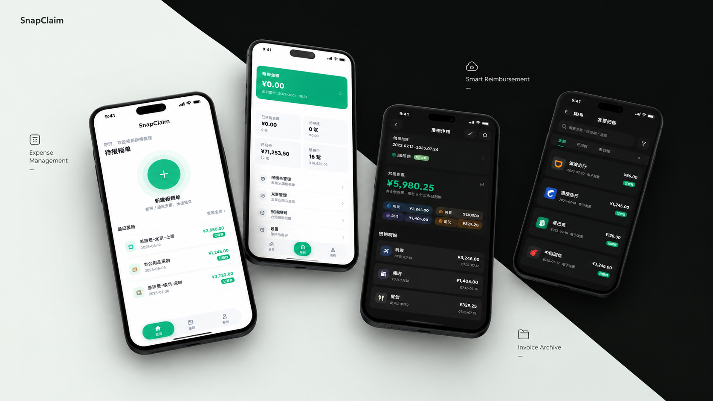

<div align="center">



# SnapClaim

**把散落在相册、邮箱和聊天记录里的发票，一点一点捡回来，整理好，最后交给报销系统。**

不用注册，不用登录，数据只存在你自己的手机里。


</div>

---

## 出差回来，票据是不是还躺在相册里

车票在 12306 截了图，机票在航司 App 里，酒店订单在同程，打车记录在微信……

等到要报销那天，你对着相册往上翻三个月，一边翻一边想：**这张是什么？什么时候开的？多少钱？**

SnapClaim 就是干这个的。它把这些散落的票据捡回来、整理成一张能直接交上去的报销单，顺便把该算的钱算明白。

---

## 三步搞定一张报销单

**1 · 建一张单**
点一下创建，选好出差日期，单子就建好了。日期一选，差补金额自动算完。

**2 · 把票据塞进去**
三种方式，怎么顺手怎么来：

| 方式 | 怎么做 |
|---|---|
| 📷 **扫一下** | 对着发票二维码扫，名称、金额自动填好 |
| 🔍 **拍一张** | 拍发票、或者直接选相册里的截图，自动识别 |
| ✍️ **手动加** | 懒得识别就自己填，同样只花几秒 |

**3 · 保存，完事**
金额汇总、退补金额都自动算好，需要归档就归档。

---

## 它能帮你做什么

### 📤 截图直接分享过来

在微信、相册、文件管理器里看到一张票据图片，选中 → 分享 → SnapClaim。

App 会自动识别、弹出一个**可以改的**预览窗，确认一下就变成报销单里的一条明细。不用先打开 App 再找图。

### 🔍 一整屏订单截图，一次识别多条

出差订票页面截一张长图，里面三张订单？SnapClaim 会自己数出来这是三笔，逐个填好金额等你确认。

（这个功能是专门为一个真实场景做的：OCR 有时候会把三张卡的金额全挤到图片最后面，看起来像"89.19、90.56、3339"三个孤零零的数字。现在的算法能按订单顺序把它们一一对上。）

### 🧮 钱不用自己算

- 差补天数自己数，**100 元/天**
- 超标的部分单独记，自动从退补里扣掉（超标不报）
- 没有飞机票，「飞机」那一行就不会出现，界面干净
- 报销单金额还能一键转成人民币大写（壹仟捌佰陆拾陆元整），照着抄就行

### 📁 报完了就归档

归档 = 已报销。首页只留该处理的，翻历史也不会和已经报完的混在一起。

### 🎒 换手机不慌

一键导出一个 `.snapbackup` 备份文件，存哪儿都行（网盘、电脑、聊天记录发给自己）。

换手机、重装 App 之后导回来就好。**还能选"合并"**——旧手机的数据和现在手机的数据拼在一起，按单据去重，不用二选一。

导出时会做一致性快照，保证拿到的不是"正在写一半的坏库"。

### 🌙 该顺眼的地方都顺眼

- 浅色 / 深色 / 跟随系统，随你挑，**记得住你的选择**
- 首次打开每个页面都有分步引导，不会迷路
- 系统开了「减少动态」，动画自动收起来，不硬播

---

## 钱是怎么算的

看不懂也没关系，App 里都算好了。想核对的话看这张表：

| 项 | 怎么来的 |
|---|---|
| **差补** | 出差天数（含头尾）× 100 元 |
| **总金额** | 所有明细 + 差补 + 超标金额 |
| **预借金额** | 飞机 + 酒店 + 用车 |
| **退补金额** | 火车 + 高速费 + 地铁费 + 差补 − 超标金额 |

明细能记六类：**火车、飞机、酒店、用车、高速费、地铁费**。用车再分「市内交通」和「往返交通」，各算各的。

---

## 你的数据在哪儿

**在你手机里，只有在你手机里。**

- 所有单据和明细存在手机本地，不上传任何服务器
- 没有账号、没有注册、没有登录，也不收集你的任何信息
- 相机权限只用来扫码，识别全程在你手机上完成
- 唯一一次联网，是你自己点击「关于」页的反馈按钮去 GitHub 提 issue

所以：**卸载 App 前记得先导出备份**，不然数据是真的没了。

---

## 安装

到 [Releases](https://github.com/SanXiaoXing/snap-claim-android/releases) 页面下载最新的 APK 文件，装到手机上即可。

> 首次安装会提示「未知来源应用」，因为这不是从应用商店装的，允许一次就好。

---

## 常见问题

**Q：需要联网吗？**
A：不需要。除了你主动点反馈按钮，App 不会联网。

**Q：会读取我的相册吗？**
A：不会主动扫。只有你自己选了一张图、或者主动把图分享给 SnapClaim 时，它才处理那一张。

**Q：识别错了怎么办？**
A：识别结果会先弹出来让你确认和修改，不会直接写进单子。改完再点确定。

**Q：数据丢了能找回吗？**
A：如果你导出过备份，可以导回来。如果没有导出过——抱歉，本地数据删了就真的没了。**建议定期导出一份。**

**Q：有其他平台的版本吗？**
A：代码里留着 iOS / macOS / Windows / Linux / Web 的工程壳，但目前**只有 Android 在维护**。

---

## 版本

当前版本 **v1.5.0**。

完整的更新记录（写得挺长的）在 [RELEASELOG.md](RELEASELOG.md)。

---

## 关于这个项目

本项目**大部分代码由 AI 生成**，人类开发者主要负责：

> 提需求 🤔 · 看 AI 写代码 👀 · 编译报错 😇 · 修复 AI 留下的「惊喜」 🧨 · 最后确认：嗯，好像能跑

一次人类与 AI 协作做 App 的小实验。

**如果发现 Bug：** 请告诉我。
**如果发现某些地方看起来像 AI 写的：** 请不要惊讶，因为确实是 AI 写的。
**如果发现 Toast 突然不见了：** ……那可能是我在调弹簧（快告诉我）🤖💥

有问题或想法，欢迎提 [Issue](https://github.com/SanXiaoXing/snap-claim-android/issues/new)。

---

<details>
<summary><b>面向开发者</b>（点开看技术细节）</summary>

### 技术栈

| 层 | 技术 | 职责 |
|---|---|---|
| UI | Flutter (Material 3) | 跨平台界面、动效与交互 |
| 核心 | Rust（`snap_claim_core`） | 票据文字的结构化解析、二维码内容解析 |
| 桥接 | flutter_rust_bridge 2.12.0 | Dart ↔ Rust 绑定 |
| 存储 | sqflite（SQLite，schema v3） | 报销单与明细本地持久化 |
| 识别 | google_mlkit_text_recognition | 图片文字识别 |
| 扫码 | mobile_scanner + image_picker | 相机 / 相册二维码识别 |

### 架构约定

- **无第三方状态库**：根 `SnapClaimApp` 是唯一可信数据源；数据向下用构造参数，变更向上用回调冒泡，`setState` 触发重建
- **颜色只走 `context.colors`**：色板是挂在 `ThemeData` 上的 `ThemeExtension`，禁止硬编码颜色
- **模型 `@immutable` + `copyWith`**：刷新一律生成新对象，列表用 `[...list]` 展开
- **Rust 调用收口**在 `lib/core/utils/`，页面不直接 import 生成代码
- **异步三段式**：`await` → `if (!mounted) return;` → `setState`
- **导航**：不用路由框架，全部 `MaterialPageRoute` 命令式 push

设计约定详见 [docs/design/ui_display_rules.md](docs/design/ui_display_rules.md) 与 [docs/design/ui_layout_rules.md](docs/design/ui_layout_rules.md)。

### 目录结构

```
snap-claim-android/
├── android/ ios/ macos/ linux/ windows/ web/   # 各平台原生壳
├── assets/                                     # 图标 + README 宣传图
├── docs/                                       # 设计约定 + 早期原型
│
├── lib/
│   ├── app/                                    # 根组件（全局状态）+ 主题色板
│   ├── features/
│   │   ├── invoice/                            # 报销单：models / pages / widgets
│   │   └── settings/                           # 我的 / 统计 / 关于
│   ├── core/
│   │   ├── backup/                             # .snapbackup 编解码与导入导出
│   │   ├── database/                           # sqflite schema、迁移、CRUD
│   │   └── utils/                              # 格式化 / OCR / 二维码 / 缓存 / 引导
│   └── src/rust/                               # flutter_rust_bridge 生成代码
│
├── rust/src/api/                               # ocr.rs（票据文字）/ qr.rs（二维码）
├── rust_builder/                               # Rust 构建插件壳
├── test/                                       # 单元 / 组件测试
└── tool/                                       # 图标生成与校验脚本
```

### 本地构建

```bash
flutter pub get
flutter run                                   # 连接真机 / 模拟器

flutter build apk --release                   # 单 APK
flutter build apk --release --split-per-abi   # 按 ABI 拆分（推荐）

flutter test                                  # Flutter 测试
cargo test --manifest-path rust/Cargo.toml    # Rust 解析逻辑测试

flutter_rust_bridge_codegen generate          # 改过 Rust 接口后重新生成桥接
```

- 需要 Flutter SDK（Dart `^3.12.2`）、Rust toolchain、Android SDK + NDK
- 首次构建会编译 Rust 静态库，耗时较长属正常
- `pubspec.yaml` 已配置 `sqlite3` 使用系统自带库，避免网络不可达时构建失败

### 备份文件格式

`.snapbackup` 是自有二进制格式，不是 zip：

```
魔数 "SNAPBACK"(8B) + 格式版本(1B) + manifest 长度(4B, 大端)
+ manifest JSON(UTF-8) + SQLite 快照字节
```

**版本号**：`pubspec.yaml` 的 `version` 是唯一来源，应用内显示与备份 manifest 都从这里取。

</details>

---

## 作者与版权

作者：**SanXiaoXing**

版权所有 © 2026 SanXiaoXing，保留所有权利。
